SteelCon - Exercise 1
==========

## Overview
This exercise will take you through
+ Setting up a GITHUB account and installing GIT on your local machine
+ 'Forking' an existing GitHub repository
+ Adding a new file to the repository
+ Creating a 'Pull Request' so that the master copy is updated.

## Registering
In your browser go to https://github.com/ and complete the form allowing you to sign up.

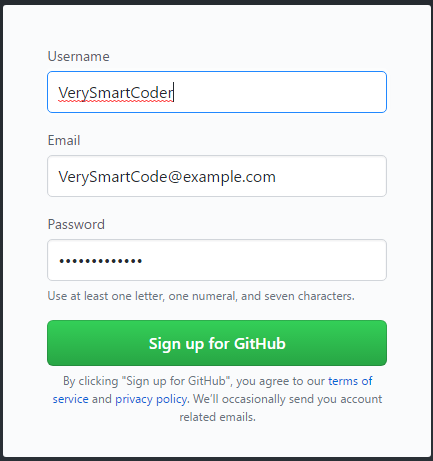

Note: The username will be used to form part of the URL to your source code.   For example, one of my repositories has the URL https://github.com/davidBetteridge/TaskVisualiser as my username is davidbetteridge.

After your username, has been accepted you will be asked what type of plan you wish to use.  For now, pick the `Free` option.

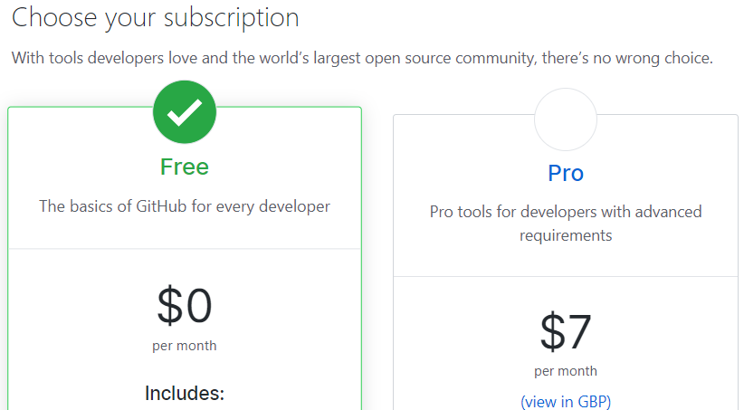

### Software

The next task is to install some software on your development machine.  Although graphical tools do exist, most real developers use the command line interface.

First make sure that git isn’t already installed by opening a command prompt and typing `git`.  If it’s already installed, then you can skip the rest of this section.

In your browser visit https://git-scm.com/downloads and click the icon for your operating system.

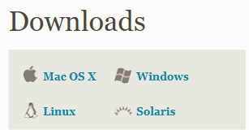

Download and install the version for your operating system.  (For windows this is just a case of following the wizard, I haven’t tried it on Linux or Macs.)

### The Process
Now we are ready to start adding some source code.  There are a few steps to carry out so it seems quite complicated at first but you will soon get used to it.

### Fork 
When you __Fork__ the source code it means that you are taking your own copy so that you can work in complete isolation to the original code.

In your browser visit the URL https://github.com/steelbuild/main-site and this will display the repository we wish to amend.

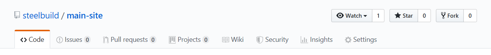

Once you are viewing the repository, click the **“Fork”** button

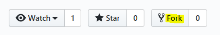

This should create a copy of the repository, but within your own account.

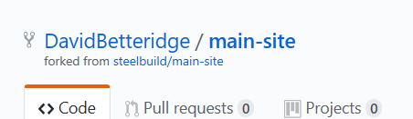
 
### Clone
Next is to clone the code from your GitHub account onto your development machine.

Click the **Clone or Download** option and then copy the URL onto your clipboard

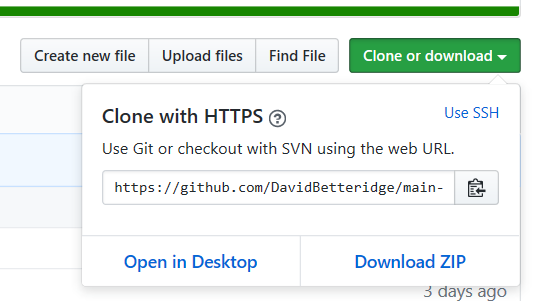

Open a command prompt on your development machine, ensure you are in the folder in which you wish to create the code and type `git clone` followed by the url

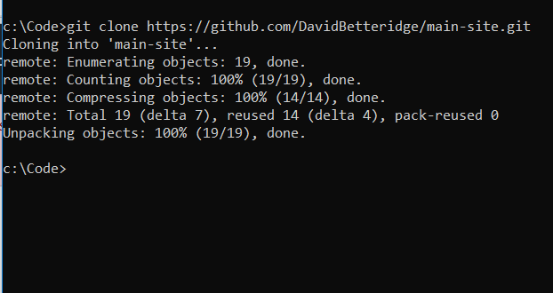

If it all goes to plan, then it should create a new folder and download all the current code from the repository into that new local folder.

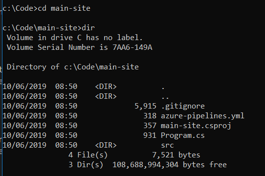

### Add

Now you can amend the website.  Add a new file to the `src` called `{yourname}.md`  For example I would create `davidbetteridge.md`

Once you have added your source code to the folder use the __git add__ command.   You can either use `git add .` to add all files,  or `git add davidbetteridge.md` to add individual files

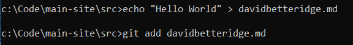

Type `git status` to view the files you have just added.  If you have added files by accident, then use the `git reset` command.

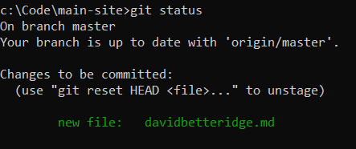

### Local Commit
The next step is to confirm your changes within the source control system on your development machine.

For this type `git commit -m Message`  where message is a comment you wish to store against the check in.

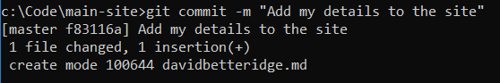

Notes
+ Using `-m` allows you to enter a summary commit message.  Here you state the action you intend to do.  For example "Fix bug on the login page",  or "Prepare release for deployment"
+ Using `-v` opens an editor allow a more verbose commit message to be entered. The first line of which is used as the summary message.

#### Push
Currently your source code is only on your local machine.  You need to also push it up to your account on GitHub.  For this we use the __git push__ command.

If you now look at your account on git hub you should see the code, you have just added.

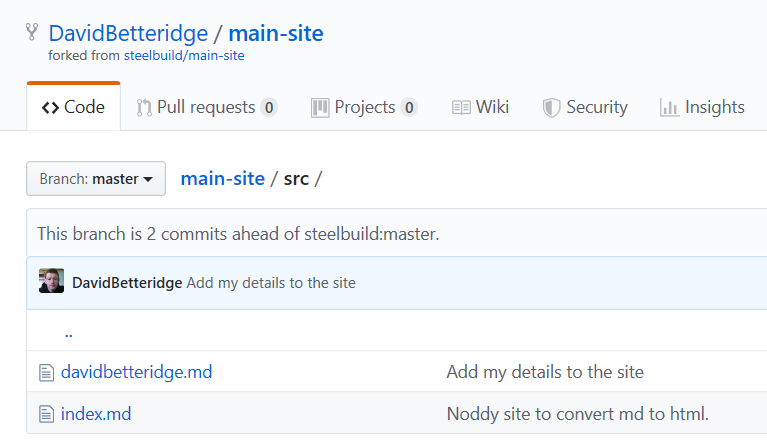

### Pull Request

Finally, you need to request that your changes are pulled into the original repository on the SteelBuild account

Click the __New pull request__ button

And then Create pull request

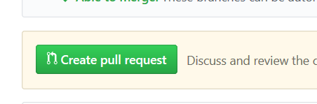

Add a comment and then click Create Pull request (again!)

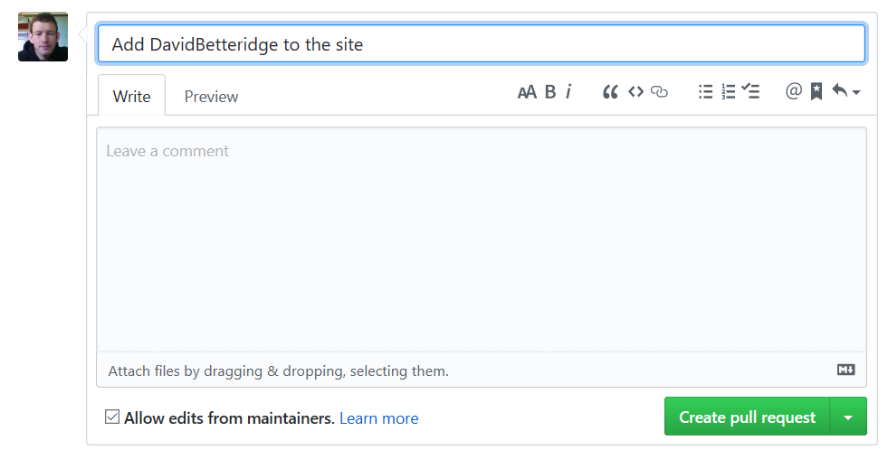

I should now get an email telling me there is a new pull request.  Once I’ve reviewed it I’ll click Merge and your source code will be included.

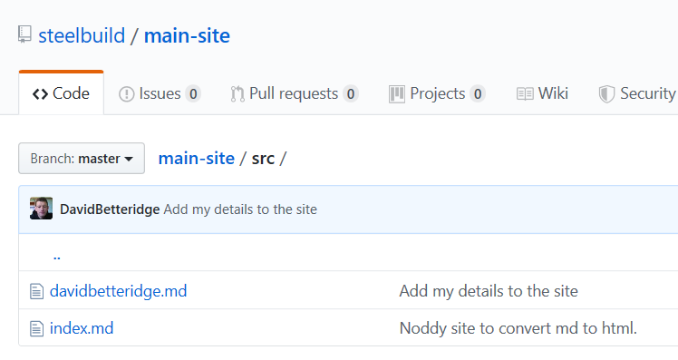