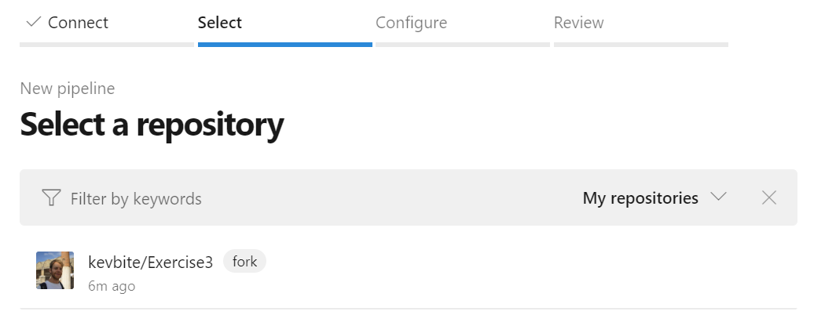

SteelCon - Exercise 3
==========

## Overview
This exercise will take you through
+ Setting up a basic build
+ Altering the build to steal some secrets

## Fork the repository
In your browser go to https://github.com/steelbuild/Exercise3 and fork the repository in to your personal account.

Click the `Fork` button in the top right hand of the screen:


Then select your personal account to fork the repository in to:


## Setup a build

Once forked head over to Azure DevOps to create a build pipeline that will build this repository.
https://dev.azure.com/SteelBuild/SteelLab/_build

Once on the build page, select `New` above the list of pipelines and select `New build pipeline`:


Next you'll get to select where your code is, most build servers support all the modern Git SaaS offering and also normally have the ability to fall back to just general git commands with authentication.

For our build we'll be selecting GitHub as that's where we forked the repository:


Since this is the first time you've tried to link GitHub with Azure DevOps, you'll get asked to verify your account so that Azure DevOp has access to your code and create web hooks:


Once we've linked the two accounts together we'll need to select the repository that we originally forked:



Azure DevOps will get you to review the build configuration file (`azure-pipelines.yml`) which it has pull out of the repository.

This file is a declarative way to describe how to build the code in code. It's very common way to setup the build as any changes to the build configuration will be track in source control the same as code is.

To kick off a build, click the `Run` button:


> If you want to learn more about build pipelines checkout the [_Create your first pipeline_](https://docs.microsoft.com/en-us/azure/devops/pipelines/create-first-pipeline?view=azure-devops&tabs=tfs-2018-2) section on the website.

After we've clicked run, the build will take a few seconds to complete, but once complete you'll see a bunch of green ticks down the page:


## Steal some secrets

There's some secret files inside this project, however, you won't be able to see them in the library due to permissions. However, you'll be able to steal them as long as you know the name of the files. These file names can normally be found within the build scripts, however, to keep things simple ours is called `production-keys.csv`.

To start off with we'll need to nip back over to GitHub and start editing our `azure-pipelines.yml`, this file is in the root of the repository.


We can simply use GitHub to edit this file by clicking on the pencil icon (`✏`). 

We're going to add in 2 extra steps in to our build configuration. The first step is to download the secure file so it can be used as part of the build.

The below is a snippet of how to download a secure file, we can declare a `DownloadSecureFile@1` task with a secureFile input value of `production-keys.csv`:

```yml
  - task: DownloadSecureFile@1
    inputs:
      secureFile: production-keys.csv
```

> More details about what the download secure file task can be found on [documentation](https://docs.microsoft.com/en-us/azure/devops/pipelines/tasks/utility/download-secure-file?view=azure-devops)


We'll also need to tell our build create some artifacts, sneakily we'll tell it to create some artifacts from the secure files we've just downloaded.

This can be done with a `PublishBuildArtifacts@1` and we'll tell it to publish our temp directory (this is where the secret files are downloaded!).


```yml
  - task: PublishBuildArtifacts@1
    inputs:
      pathtoPublish: '$(Agent.TempDirectory)'
```

> More details about what the publish build artifacts task can be found on [documentation](https://docs.microsoft.com/en-us/azure/devops/pipelines/tasks/utility/publish-build-artifacts?view=azure-devops)

Our `azure-pipelines.yml` should now look like the following:

```yml
pool:
  vmImage: 'windows-2019'

steps:
  - task: DownloadSecureFile@1
    inputs:
      secureFile: production-keys.csv
      
  - powershell: ./build.ps1
    displayName: 'Build'

  - task: PublishBuildArtifacts@1
    inputs:
      pathtoPublish: '$(Agent.TempDirectory)' 
```

Now if we commit these changes it will trigger off a new build inside Azure DevOps.

Once build you'll now see an Artifacts button, clicking on this you'll be able to download our published artifacts:


## Steal variable secret

Part of the build process uses an API Key that comes from a secure variable group, this key is encrypted and you also have no access to it, however the build scripts can use it.

Try figure out a way to steal the API Key!


